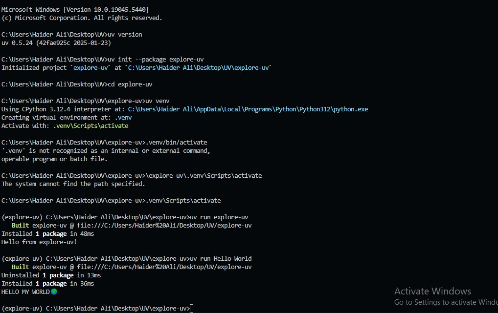

# Setting Up a UV Project in VS Code

## Install UV

First install the `uv` in your local system.Then make sure you have `uv` installed. You can check the version with:

```sh
uv version
uv help
```

## Initialize a New UV Project

To create a new project structured for packaging, run command:

```sh
uv init --package explore-uv
```

This will set up a project with a `src` directory.

## Open the Project in VS Code

Navigate into the project folder:

```sh
cd explore-uv
```

## Create a Virtual Environment

To create a virtual environment, use:

```sh
uv venv
```

### Activate the Virtual Environment

#### On Windows:

```sh
.venv\Scripts\activate
```

## Run the UV Project

To run your project, use:

```sh
uv run explore-uv
```

## Screenshot

Screenshot of my very first uv project in which i faces many errors but at the end from this error, learn new things from error handling that help me to improve my skills in my **_AI JOURNEY_**.


